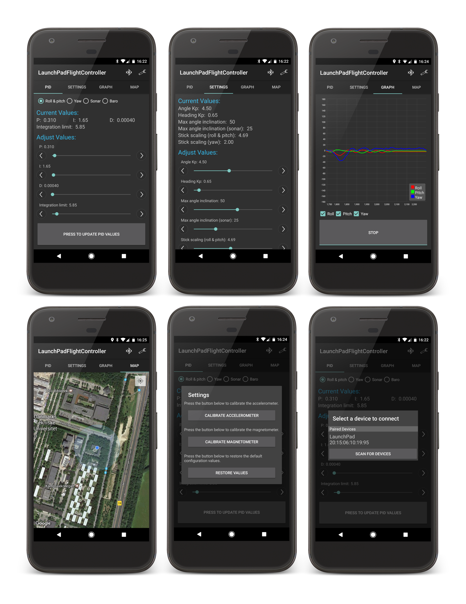

# LaunchPad Flight Controller Android app

#### Developed by Kristian Lauszus, 2015

The code is released under the GNU General Public License.
_________

This the Android app intended to be used with my custom flight controller: <https://github.com/Lauszus/LaunchPadFlightController>.

In order to built this project you need to download [Android Studio](http://developer.android.com/sdk/index.html).

# Screenshots

For more information send me an email at <lauszus@gmail.com>.
